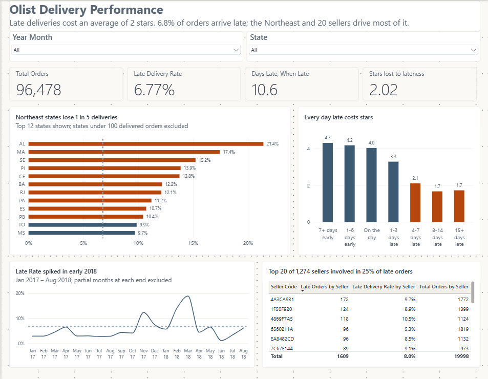
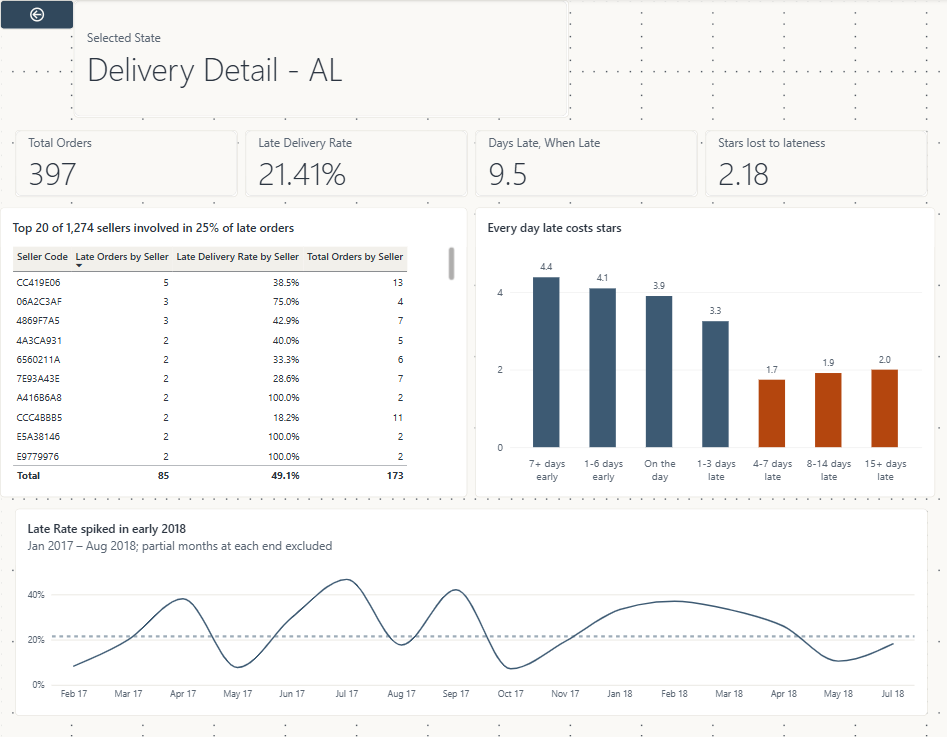
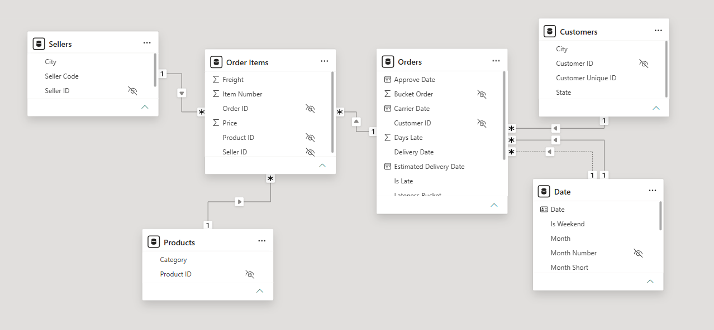
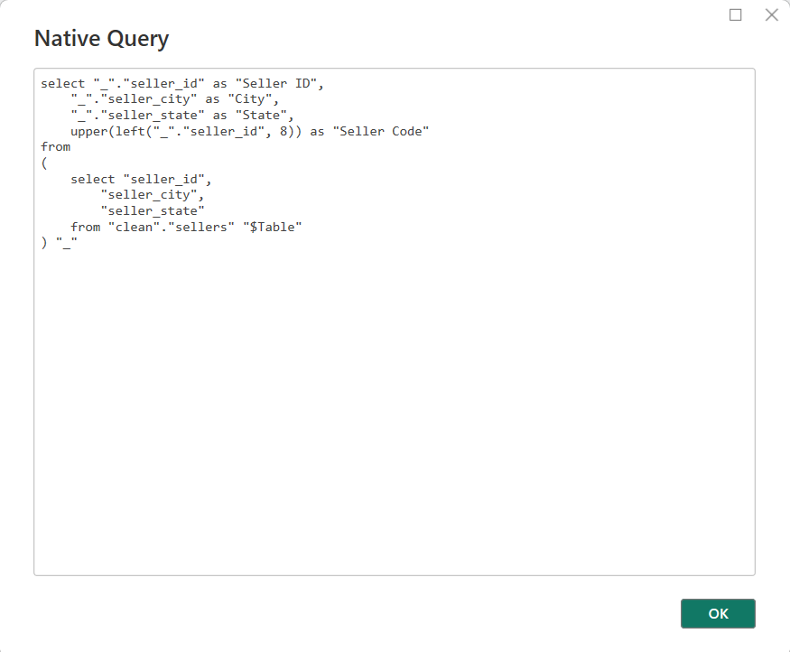
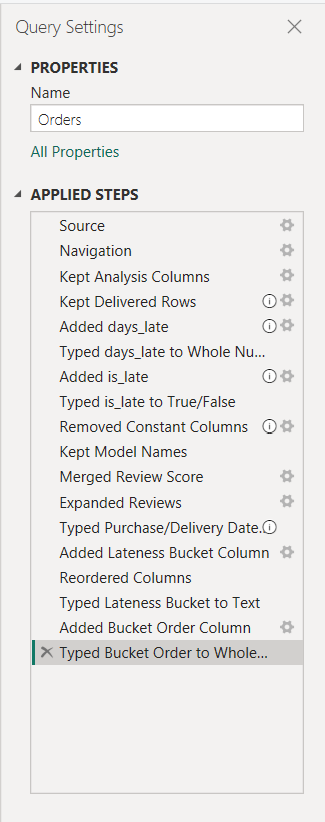

# Olist Delivery Performance

**Does late delivery drive bad review scores — by how much, and which sellers and states are responsible?**



---

## The finding

Olist delivers **6.77%** of orders late. When it is late, it is late by **10.6 days** on average — against a delivery estimate already padded by a median of **24 days**.

Those late orders score **2.27 stars** against **4.29** for on-time deliveries.

**A late delivery costs roughly two stars.**

The relationship is **dose-response, not binary**. Average review score declines monotonically from 4.5 stars (delivered a week or more early) to 1.7 (15+ days late), with the sharp break between "1–3 days late" and "4–7 days late". A threshold effect would show a cliff; this shows a slope, which is much harder to dismiss.

### Where the problem sits

**Geographically:** five neighbouring Northeast states — Alagoas, Maranhão, Sergipe, Piauí and Ceará — run at roughly three times the national late rate, with Alagoas worst at 21.4%. The ranking between them is fragile on those sample sizes; the cluster is not.

**Operationally:** 1,274 sellers have at least one late order, and **20 of them are involved in 24.7%** of all late orders. That is a tractable intervention list, unlike a regional logistics problem that takes years to fix.



---

## Why this question

It cannot be answered from a flat table. Lateness lives in `orders`, review scores live in `reviews`, and attribution lives in `sellers` — the answer only exists once those are related correctly, at the right grain, with filters flowing in the right direction.

That was the point of choosing it.

---

## The model



**Two fact tables at two grains**, because there are two business processes:

- `Orders` — one row per delivered order. Lateness and review score.
- `Order Items` — one row per item within an order. Price and freight.

Flattening lateness onto `Order Items` would have made seller analysis trivially easy — and would have weighted every review score by basket size, silently distorting the headline finding. That trade-off is written up in the decision log.

**All relationships are one-to-many and single-direction.** Where a filter needed to travel against the grain — seller-level lateness — it is opened for **one measure** with `CROSSFILTER`, not model-wide. Bidirectional cross-filtering was rejected and the reasoning recorded.

**A dedicated date table** covering full calendar years, marked as a date table, with two role-playing relationships: purchase date active, delivery date inactive and reached via `USERELATIONSHIP`.

---

## How it was built

```
PostgreSQL (raw → clean)  →  Power Query  →  star schema  →  DAX  →  report
```

**PostgreSQL as the source, not CSVs.** Two things a relational source buys that flat files cannot: query folding, and type enforcement at load. Both are verifiable rather than claimed.



That is the SQL Power Query generated and pushed to Postgres. Column selection and the delivered-orders filter run at the source; only the non-foldable steps run locally. The chain was originally built in the wrong order — derivations before filters — which broke folding and shipped 99,441 rows instead of 96,478. Reordering fixed it.

**Raw staged as text, then cast in a clean layer.** You cannot profile values the database refused to accept. Staging as `text` makes a census of cast failures possible; the clean layer then casts strictly and counts everything it rejects.

**The `clean` layer is views, not tables.** Nothing is copied, so it cannot drift out of sync, and the definition of "clean" is readable SQL rather than a load script that ran once.



---

## Verification

Every figure in the report is reproduced independently in SQL and in DAX, and recorded in a baselines table before the measure that produces it is written.

| Metric | Value |
|---|---:|
| Delivered orders | 96,478 |
| Late orders | 6,534 |
| Late rate | 6.77% |
| Avg days late, when late | 10.62 |
| Avg review score — late | 2.27 |
| Avg review score — on time | 4.29 |
| Revenue | R$ 13,221,498.11 |

This caught real problems. A late-order count of 6,535 against a baseline of 6,534 turned out to be six orders that were delivered and then cancelled — a population difference, not an arithmetic error, and invisible without a reference number.

---

## Repository

```
data/        the 8 source CSVs (geolocation excluded by design)
sql/         schema, load, profiling, and the clean layer
report/      .pbip (readable TMDL + PBIR) and .pbix (opens with data)
docs/        decision log, data dictionary, measure catalog, gotchas
images/      screenshots
```

**Both report formats are included deliberately.** The `.pbip` is a folder of text files — every DAX measure, relationship and M query is readable on GitHub without installing anything. It stores the definition only. The `.pbix` has the data cached inside it and opens standalone.

### Documentation

- **[Decision log](docs/decision-log.md)** — 38 non-obvious choices, each with the alternative rejected and why. The most useful file here.
- **[Data dictionary](docs/data-dictionary.md)** — tables, verified grain, what was filtered and why, baselines.
- **[Measure catalog](docs/measure-catalog.md)** — every measure, in plain English, with its filter-context behaviour and any non-additivity warning.
- **[Gotchas](docs/gotchas.md)** — bugs hit during the build and what each turned out to be.

---

## Running it

1. Download the dataset from Kaggle and extract the CSVs into data/. The geolocation file isn't used.
2. Install PostgreSQL 17 and create a database called `olist`.
3. Run the scripts in `sql/` in numbered order. They create the `raw` and `clean` schemas, load the CSVs from `data/`, and build the views.
   - `\copy` paths are absolute — edit them to match your data directory.
4. Open `report/olist-delivery-performance.pbip` in Power BI Desktop and point the PostgreSQL connection at `localhost:5432`.

To view the report without a database, open the `.pbix` instead. Import mode means the data is cached inside it.

### Known limitations

- The source is a local PostgreSQL instance, so the published report cannot be refreshed without an on-premises gateway. The dataset is static (Sept 2016 – Oct 2018), so refresh has no value here.
- Publish to web is disabled by the hosting tenant, so there is no live public link. A recorded walkthrough is linked above.
- Seller identities are anonymised hashes in the source data. Sellers are shown by truncated code and analysed distributionally rather than named.
- Seller-level lateness is **allocated**: every seller on a multi-seller late order is charged with that lateness. 98.7% of orders have a single seller, so the distortion is bounded and quantified in the decision log.

---

## Data

[Brazilian E-Commerce Public Dataset by Olist](https://www.kaggle.com/datasets/olistbr/brazilian-ecommerce) — ~100k orders, September 2016 to October 2018, released under CC BY-NC-SA 4.0.
